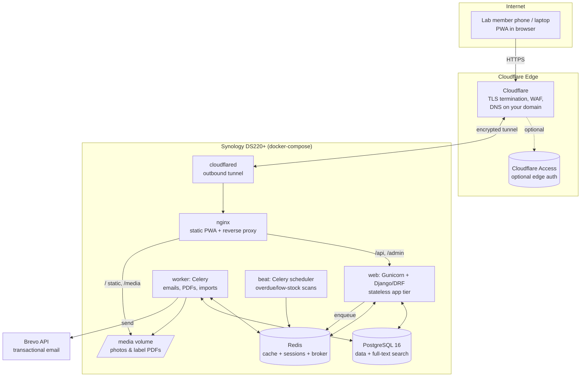
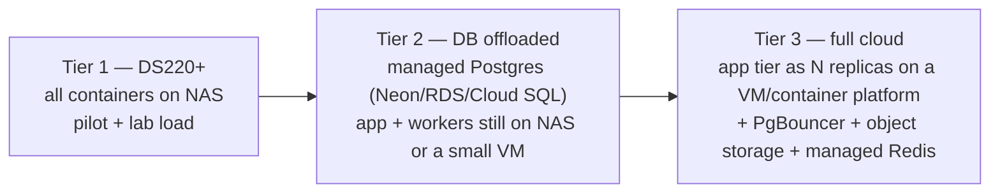

# Architecture

## 1. High-level topology

**Request path:** browser → Cloudflare (TLS/WAF) → encrypted tunnel → `cloudflared`
→ nginx → Django. No router ports opened, NAS IP never exposed. Because Cloudflare
serves the app on your HTTPS domain, the browser is in a **secure context**, which
is what unlocks `getUserMedia` (camera) for QR scanning and photo capture.

## 2. Chosen stack & rationale

| Layer | Choice | Why (given constraints) |
|---|---|---|
| **Backend** | **Django 5 + Django REST Framework** | Batteries-included auth, migrations, admin, and a mature permissions ecosystem. Object/row-level scoping for multi-tenant + project RBAC via `django-guardian`. Fewer moving parts than assembling Node equivalents → less to maintain for a small team. Strong data modeling for the heterogeneous asset model. |
| **DB** | **PostgreSQL 16** | Handles 50k+ rows trivially with proper indexes; native **full-text search** (`tsvector`) and **fuzzy** (`pg_trgm`) mean no separate Elasticsearch container (saves RAM). JSONB for category custom fields. Clean lift-and-shift to managed Postgres (RDS/Cloud SQL/Neon). |
| **Async/queue** | **Celery + Redis** | Emails, label-PDF batches, and CSV imports run off-request. Redis does **triple duty**: Celery broker, cache, and session store — one small container instead of three services. |
| **Frontend** | **React + TypeScript + Vite, as a PWA** | Mobile-first, installable to home screen, offline shell. SPA talks to DRF over JSON. Vite builds static assets nginx serves directly. |
| **Component lib** | **Mantine** (or MUI) | Fast, consistent, accessible components incl. calendar/date pickers and data tables; good mobile ergonomics; built-in dark mode. |
| **QR scanning** | **`@zxing/browser`** (or `html5-qrcode`) | Pure-browser camera scanning, no native app. Works in the secure HTTPS context. |
| **Label PDF** | Server-side **WeasyPrint** (HTML→PDF) + **`segno`** (QR) | Renders Avery-style sheets from an HTML template; runs in the Celery worker for batches. |
| **Web/static** | **nginx** | Serves the built PWA + `/media`, reverse-proxies `/api`. Tiny footprint. |
| **Edge/exposure** | **Cloudflare Tunnel (`cloudflared`)** | See `deployment.md`. Secure exposure without port-forwarding. |
| **Email** | **Brevo transactional API** behind an interface | See §6. |

**Why not an all-in-one (e.g. Next.js full-stack) or Node/Nest?** Viable, but for
this app the heavy lifting is data modeling, RBAC, admin, background jobs, and
imports — exactly Django's strengths, out of the box. A Node stack would mean
hand-building admin/RBAC/migrations and typically more containers. Django keeps
the container count and the maintenance surface low, which matters on a 6 GB NAS
run by a small team. React stays as the frontend either way.

**Why PostgreSQL over SQLite?** SQLite is single-writer and would bottleneck under
concurrent check-outs/reservations and background writes, and it has no real
full-text/fuzzy search or connection pooling story for the scale-out path.
Postgres is the safer default at 50k items / 300 users and the multi-tenant model.

## 3. Multi-tenancy approach

**Shared database, shared schema, row-level scoping by `tenant_id`** (the
"discriminator" pattern).

- Every tenant-owned table carries `tenant_id` (FK to `Tenant`), indexed, and
  composite-indexed with the columns it's filtered/sorted by.
- A **base queryset manager + DRF permission/middleware** injects the current
  tenant from the authenticated user and filters *every* query — tenant isolation
  is enforced centrally, not per-view, to avoid leaks.
- Postgres **Row-Level Security (RLS)** policies are enabled as defense-in-depth so
  a missed filter still can't cross tenants.
- Rationale vs. schema-per-tenant or db-per-tenant: at ~tens of tenants and one
  small NAS, shared-schema is by far the leanest (one connection pool, one backup,
  one migration run) and still isolates data. Schema-per-tenant is the documented
  escape hatch if a tenant ever needs physical isolation.

See `data-model.md` for the concrete tables.

## 4. Scalability & performance strategy

**Targets (tier-1 DS220+, 50k assets / 300 users / ~30 concurrent):**

| Operation | Target (p95, server-side) |
|---|---|
| Paginated asset list (25/page, filtered) | < 300 ms |
| Full-text search across attributes | < 500 ms |
| Asset detail (scan → open) | < 250 ms |
| Dashboard aggregate load | < 800 ms (cached) |
| Check-in/out write | < 300 ms |

**How we hit and hold them:**

- **Stateless app tier.** No local session/file state in `web`; sessions and cache
  live in Redis; uploads go to the mounted volume/object store. → run N replicas or
  move hosts with zero code change (12-factor).
- **Externalized session state** in Redis (not in-process, not sticky).
- **Server-side pagination + server-side search/filter** on every list. The client
  never loads "all assets"; long lists use windowed/virtualized rendering.
- **Indexing & query optimization.** Composite indexes on
  `(tenant_id, status)`, `(tenant_id, category_id)`, `(tenant_id, location_id)`;
  GIN index on the `tsvector` search column and on JSONB custom fields;
  `pg_trgm` GIN for fuzzy name/serial search. `select_related`/`prefetch_related`
  to kill N+1s. Query budgets asserted in tests.
- **Connection pooling.** `PgBouncer`? — not needed at tier-1; use Django
  `CONN_MAX_AGE` persistent connections. PgBouncer is added at the cloud tier when
  running many app replicas.
- **Caching (optional, deliberate).** Redis caches dashboard aggregates and
  reference data (categories, locations) with short TTL + event-based
  invalidation. Redis `maxmemory` capped (see below) so cache never crowds the NAS.
- **Background jobs** (Celery) for anything slow: Brevo emails, label-PDF batches,
  CSV import/validation, report exports, overdue/low-stock scans. Requests never
  block on them.
- **Attachments off the DB.** Photos/PDFs on the mounted volume via
  `django-storages`, swappable to S3-compatible object storage — keeps the DB small
  and fast and backups cheap.

**Where the bottlenecks are, in order:** (1) DB CPU/IO on the NAS's dual-core
Celeron under aggregate dashboard queries — mitigated by caching + indexes;
(2) Celery worker RAM during large imports/PDF batches — mitigated by chunked
processing and a bounded concurrency; (3) Postgres shared_buffers vs. the 6 GB
budget — tuned small (see `deployment.md`). None are code-shape problems, so
scaling out is configuration.

## 5. Tiered deployment / scale-out path (config, not rewrite)

Because the app is stateless and 12-factor:
- **(a) Move DB to managed Postgres:** change `DATABASE_URL`, run migrations,
  restore a dump. No code change.
- **(b) Move app tier to cloud:** run the same image on a VM/K8s, scale replicas,
  point at the managed DB/Redis and object storage via env vars. No code change.
- Object storage swap (volume → S3-compatible): change `django-storages` settings.

## 6. Email provider abstraction (Brevo)

- **Interface:** an `EmailProvider` protocol with
  `send_transactional(template_id, to, params, ...)`. Business logic emits
  *domain events* ("reservation approved", "item overdue", "low stock") that map to
  templated emails — it never imports Brevo directly. A `BrevoProvider` implements
  the interface; a `ConsoleProvider` is used in dev/tests. Swapping providers =
  new class + env var, no business-logic edits.
- **API vs. SMTP — recommend the transactional API.** The HTTP API gives
  structured template rendering (Brevo-hosted templates by ID), per-message
  metadata, delivery/bounce webhooks, and cleaner error handling than SMTP.
  SMTP relay is kept as a fallback `EmailProvider` implementation (same interface)
  in case API access is unavailable.
- **Async + resilient.** Every send is a Celery task with retry/backoff; failures
  are logged to an `EmailLog` table (recipient, event, status, provider message-id,
  error). A request is *never* blocked on email.
- **Deliverability.** SPF, DKIM, and DMARC records added on Cloudflare DNS for the
  sender domain (Brevo provides the exact records). Respect Brevo's daily
  send-tier limits; batch/throttle bulk notifications in the worker.
- **Secrets.** `BREVO_API_KEY` (or SMTP creds) only ever in environment secrets.
- **Per-user preferences.** A `NotificationPreference` per user × event type gates
  optional emails (transactional security emails are always sent).

## 7. Security architecture (summary; see deployment.md for edge hardening)

- Argon2/bcrypt password hashing; Django session auth for the web app (Redis-backed,
  HttpOnly + Secure + SameSite cookies); short-lived JWT optional for future
  device/API clients.
- CSRF protection on state-changing endpoints; DRF throttling; strict CORS (same
  origin via nginx); security headers (HSTS, CSP, X-Content-Type-Options) at nginx.
- Least-privilege RBAC (see `rbac.md`) enforced server-side on every endpoint, plus
  tenant scoping + Postgres RLS.
- Secrets via env/`.env` file mounted from Synology (not in image, not in git);
  documented path to Docker/Cloudflare secrets.
- Immutable audit log of every asset movement, stock change, reservation, and admin
  action.
