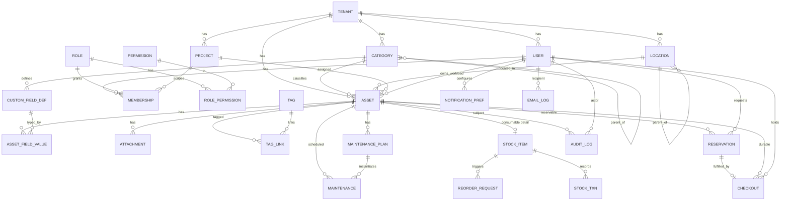

# Data Model

All tenant-owned tables carry `tenant_id` (indexed, and composite-indexed with the
columns they're filtered/sorted by). Omitted from the diagram for readability
except on `Tenant` itself. Timestamps (`created_at`, `updated_at`) and soft-delete
(`is_active`/`retired_at`) are implied on core entities.

## 1. ERD

## 2. Core entities

### Tenancy & identity
- **Tenant** — a lab/organization. `id, name, slug, settings(jsonb), created_at`.
- **User** — `id, tenant_id, email(unique per tenant), password_hash, name, is_active, last_login`. (Global-unique email optional; scoped per tenant by default.)
- **Role** — named bundle of permissions: `Admin, ProjectLead, Member, Viewer` (system roles, tenant may add custom). `id, tenant_id(nullable for system), key, name`.
- **Permission** — atomic action key, e.g. `asset.create`, `stock.adjust`, `reservation.approve`, `user.manage`, `audit.view` (see `rbac.md`).
- **RolePermission** — Role ↔ Permission.
- **Membership** — a user's role **within a scope**: `user_id, role_id, project_id(nullable → tenant-wide)`. A ProjectLead has a Membership scoped to a project; an Admin has a tenant-wide Membership. This is what makes permissions project-scoped.

### Classification & structure
- **Project** — `id, tenant_id, name, lead_user_id, is_active`. Assets can be assigned to a project or left in the general pool (`project_id NULL`).
- **Category** — self-referential tree (Compute, Edge, Drone Kit, Drone Electronics, Components, Tools, Instruments…). Carries the two orthogonal flags as defaults: `default_is_consumable(bool)`, `requires_approval(bool)` (drives the per-category approval config), `requires_calibration(bool)`.
- **CustomFieldDef** — per-category field definitions for the flexible spec model: `id, category_id, key, label, data_type(text|int|float|bool|date|enum|json), unit, enum_options(jsonb), required, order`. E.g. Compute → `gpu_model`, `vram_gb`, `cpu`, `ram_gb`, `os`, `hostname`.
- **Location** — self-referential tree: Room → Shelf → Cabinet → Bin. `id, tenant_id, parent_id, name, kind`.

### Assets
- **Asset** — the central record.
  - Identity: `id (uuid, public code), tenant_id, category_id, name, description`.
  - Type flags: `is_consumable(bool)`, `project_id(nullable)`.
  - Physical/commercial: `serial_number, manufacturer, model, location_id, purchase_date, purchase_cost, currency, warranty_expiry, supplier`.
  - State: `status(available|in_use|reserved|maintenance|retired|lost)`, `condition(notes)`.
  - Workload (for compute): `current_workload_user_id(nullable)`.
  - `qr_token` — stable opaque token encoded in the label QR; resolves to this asset.
  - Search: `search_vector(tsvector)` maintained by trigger over name/serial/tags/custom values.
- **AssetFieldValue** — value of a CustomFieldDef for an asset (`asset_id, field_def_id, value(jsonb)`). GIN-indexed for filtering.
- **Attachment** — photos/docs: `id, asset_id, kind(photo|doc), storage_key, filename, content_type, uploaded_by`. **Binary lives on the volume/object store**, only the key is in the DB.
- **Tag** / **TagLink** — free-form tagging, many-to-many.

### Consumables & stock
- **StockItem** — 1:1 extension of a consumable Asset: `asset_id, unit_of_measure, quantity_on_hand, reorder_threshold, reorder_target, bin_location_id`.
- **StockTxn** — immutable ledger of every quantity change: `stock_item_id, delta, reason(receive|consume|adjust|correction), ref, actor_id, created_at`. Quantity is derived/checked against the ledger.
- **ReorderRequest** — lightweight reorder workflow: `stock_item_id, requested_by, quantity, status(open|approved|ordered|received|cancelled), note`.

### Reservations & checkout
- **Reservation** — durable-asset booking: `asset_id, user_id, project_id(nullable), start_at, end_at, status(pending|approved|rejected|cancelled|fulfilled|expired), approver_id, approval_note`. Conflict detection via exclusion constraint on overlapping `[start_at, end_at)` per asset for active statuses.
- **Checkout** — actual possession: `asset_id, user_id, reservation_id(nullable), checked_out_at, due_at, checked_in_at, checkout_condition, checkin_condition, is_overdue`. Open checkout = `checked_in_at NULL`.

### Maintenance & calibration
- **MaintenancePlan** — recurring schedule for an asset/instrument: `asset_id, kind(maintenance|calibration), interval_days, last_done_at, next_due_at`.
- **Maintenance** — a logged event/instance: `asset_id, plan_id(nullable), kind, scheduled_for, performed_at, performed_by, result, notes, cost`. Beat scans `next_due_at` to flag due/overdue.

### Audit, notifications, email
- **AuditLog** — append-only, immutable: `id, tenant_id, actor_id, action, entity_type, entity_id, before(jsonb), after(jsonb), ip, created_at`. Written for every movement, stock change, reservation, and admin action. No update/delete permitted (enforced by app + DB trigger).
- **NotificationPref** — `user_id, event_type, email_enabled(bool)`.
- **EmailLog** — `id, tenant_id, user_id, event_type, provider, provider_message_id, status(queued|sent|failed|bounced), error, created_at`.

## 3. Key indexes (performance)

- `asset (tenant_id, status)`, `asset (tenant_id, category_id)`, `asset (tenant_id, location_id)`, `asset (tenant_id, project_id)`.
- GIN on `asset.search_vector`; `pg_trgm` GIN on `asset.name`, `asset.serial_number`.
- GIN on `asset_field_value.value` (JSONB) for spec filters.
- `checkout (tenant_id, checked_in_at)` partial where `checked_in_at IS NULL` (open items).
- `reservation` GiST exclusion on `(asset_id, tstzrange(start_at,end_at))` where active.
- `stock_item (tenant_id)` + partial index where `quantity_on_hand <= reorder_threshold` (low-stock scan).
- `maintenance_plan (tenant_id, next_due_at)` for due/overdue scans.
- `audit_log (tenant_id, entity_type, entity_id, created_at)`.

## 4. Notes on the two orthogonal properties

- **Consumable vs. durable** is a boolean on `Asset` (defaulted from Category).
  Consumables get a `StockItem` + `StockTxn` ledger; durables get
  `Reservation`/`Checkout`. An asset is one or the other, never both.
- **General-pool vs. project-assigned** is `Asset.project_id` (NULL = general
  pool). This drives both dashboards (per-project allocation) and project-scoped
  RBAC.
