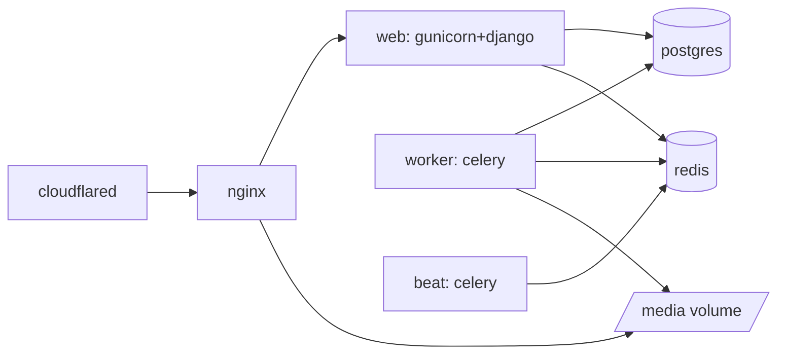

# Deployment — Synology DS220+ + Cloudflare Tunnel

> **RAM note.** The prompt body states the DS220+ has **6 GB** (its maximum);
> deliverable #7 said "2 GB". The DS220+ ships with 2 GB and is expandable to 6 GB.
> We target **6 GB** and show the footprint also fits well under it. If the unit is
> still at 2 GB, see the "2 GB fallback" at the end. **Confirm actual installed RAM.**

## 1. docker-compose topology

Seven small containers, each with a memory limit (`deploy.resources` /
`mem_limit`):

| Service | Image (base) | Role | `mem_limit` (target) |
|---|---|---|---|
| `postgres` | postgres:16-alpine | Primary DB + FTS | 1024 MB (shared_buffers ~256 MB) |
| `redis` | redis:7-alpine | Cache + sessions + broker | 320 MB (`maxmemory 256mb`, `allkeys-lru`) |
| `web` | app image (python) | Gunicorn (2–3 workers) + Django | 768 MB |
| `worker` | app image | Celery worker (concurrency 2) | 768 MB |
| `beat` | app image | Celery beat scheduler | 192 MB |
| `nginx` | nginx:alpine | Static PWA + reverse proxy | 96 MB |
| `cloudflared` | cloudflare/cloudflared | Tunnel | 96 MB |
| **Total** | | | **~3.25 GB limits** |

Comfortably inside 6 GB with room for the DSM OS and file cache. `beat` can be
folded into `worker` (`celery -B`) to shave another container if desired.
`web` and `worker` share **one built image** (different command) → one build, less
disk. All app config via **environment** (12-factor); no host assumptions.

### Volumes
- `pgdata` → Postgres data (on a Synology shared folder).
- `media` → asset photos + generated label PDFs (mounted into `web`, `worker`,
  `nginx`). `django-storages` filesystem backend now; swap to S3-compatible later
  with only settings changes.
- `.env` file mounted read-only from a Synology folder for secrets.

## 2. Synology Container Manager steps

1. **Install Container Manager** (DSM Package Center).
2. **Create a shared folder** `docker/cortex` with subfolders `pgdata`, `media`,
   `secrets`. Put `.env` in `secrets` (permissions restricted to the container user).
3. **Copy the project** (compose file + built images, or a private registry
   reference) to `docker/cortex`.
4. In Container Manager → **Project → Create**, point at the `docker-compose.yml`,
   set the env-file path. Container Manager parses compose and manages the stack.
5. **Start** the project. Run initial `manage.py migrate` and
   `createsuperuser`/seed via a one-off exec into `web`.
6. **Enable auto-restart** (`restart: unless-stopped`) so the stack survives reboots.
7. Schedule **DSM Task Scheduler** jobs for backups (see §5).

## 3. Cloudflare Tunnel (recommended exposure)

**Why Tunnel over DDNS + port-forward + reverse-proxy + Let's Encrypt:**

| | Cloudflare Tunnel (recommended) | DDNS + port-forward + LE |
|---|---|---|
| Router ports opened | **None** (outbound only) | 80/443 inbound |
| NAS public IP exposed | **No** | Yes |
| TLS certs | Managed at edge | You manage renewals |
| DDoS / WAF | Cloudflare edge | You |
| Residential-IP/CGNAT issues | **Unaffected** | Often broken by CGNAT |
| Maintenance | Low | Higher |

Tunnel wins on security **and** maintenance for a home/lab NAS.

**Setup:**
1. In Cloudflare Zero Trust → **Networks → Tunnels → Create tunnel**; name it
   (e.g. `cortex-nas`). Copy the tunnel **token**.
2. Add the token to `.env` (`TUNNEL_TOKEN`), consumed by the `cloudflared`
   container (`command: tunnel run`).
3. Add a **public hostname** route: `cortex.yourdomain.com` → service
   `http://nginx:80` (internal to the compose network).
4. Cloudflare auto-creates the DNS/CNAME and serves the app over **HTTPS at the
   edge** on your domain. Set SSL mode **Full (strict)**; enable **HSTS**,
   **Always Use HTTPS**, and Bot Fight Mode.
5. Because the browser now loads the app over `https://cortex.yourdomain.com`, it's in
   a **secure context** → `getUserMedia` works → **camera QR scan and photo
   capture function on phones** with no extra cert work. (This is the entire reason
   the mobile flow "just works.")

## 4. Optional Cloudflare Access (edge auth)

You chose **app login only** for MVP. Access is documented as a **toggle**:

- Put a Cloudflare Access **application** in front of `cortex.yourdomain.com` (or just
  `/admin` and `/api/v1/users*`) requiring email OTP or SSO **before** the app
  loads.
- Trade-off: strongest hardening but an extra login step for members. Recommended
  scope if enabled later: **admin routes only**, leaving member scan/checkout
  friction-free.

## 5. Backup & restore (Synology)

- **DB:** nightly `pg_dump` from the `postgres` container to
  `docker/cortex/backups/` (DSM Task Scheduler running a `docker exec pg_dump`
  one-liner). Keep N daily + weekly (rotate).
- **Media:** the `media` shared folder is included in **Synology Hyper Backup**
  (to an external USB drive and/or a cloud/B2 target).
- **Config:** `.env`/compose backed up to an offline location (contains secrets —
  encrypt).
- **Restore drill:** `pg_restore`/`psql < dump` into a fresh `postgres`, restore
  `media` folder, `docker compose up`. Document and **test this** (see `risks.md`).
- **Tier-2 note:** moving to managed Postgres shifts DB backups to the provider's
  PITR; media backups stay as above (or move to object storage with lifecycle
  rules).

## 6. Secrets & environment

- All secrets in the mounted `.env` (never in image/git): `SECRET_KEY`,
  `DATABASE_URL`, `REDIS_URL`, `BREVO_API_KEY`, `TUNNEL_TOKEN`, `ALLOWED_HOSTS`,
  `MEDIA_STORAGE_*`.
- Django `DEBUG=false`, `SECURE_*` headers on, `ALLOWED_HOSTS` pinned to the
  domain, `CSRF_TRUSTED_ORIGINS` = the domain.
- Documented upgrade path to Docker secrets / a secrets manager at the cloud tier.

## 7. Hardening checklist (internet-facing)

- Cloudflare: Full(strict) TLS, HSTS, Always-HTTPS, WAF/Bot Fight, rate-limit rules
  on `/api/v1/auth/login`.
- App: DRF throttling, account lockout/backoff on failed logins, Argon2 hashing,
  Secure/HttpOnly/SameSite cookies, CSP + security headers at nginx.
- Least-privilege RBAC + tenant isolation + Postgres RLS backstop.
- No inbound router ports; NAS admin (DSM) **not** exposed via the tunnel.
- Regular image updates; pinned base image digests; minimal Alpine images.
- Audit log monitored; email failure log reviewed.

## 8. 2 GB fallback (if RAM isn't upgraded)

Still runnable but tight: drop `beat` into `worker` (`-B`), Gunicorn workers → 2,
Celery concurrency → 1, Redis `maxmemory 128mb`, Postgres `shared_buffers 128MB`,
disable dashboard caching. Expect slower dashboards and less headroom for imports.
**Recommendation: upgrade to 6 GB** — it's cheap and removes the constraint.
