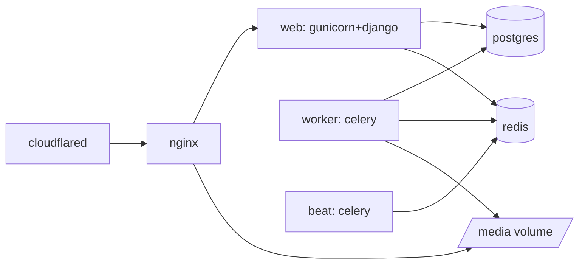

# Deployment — Synology DS220+ + Cloudflare Tunnel

> **Design-level overview.** This document covers topology, rationale, and
> the hardening checklist. For the precise, copy-pasteable, numbered
> operator steps (Cloudflare dashboard clicks, DNS record templates,
> Container Manager shared-folder layout, first-bring-up commands,
> verification checklist), see **`docs/deployment-runbook.md`** (T6.4).

> **RAM note.** The prompt body states the DS220+ has **6 GB** (its maximum);
> deliverable #7 said "2 GB". The DS220+ ships with 2 GB and is expandable to 6 GB.
> We target **6 GB** and show the footprint also fits well under it. If the unit is
> still at 2 GB, see the "2 GB fallback" at the end. **Confirm actual installed RAM.**

## 1. docker-compose topology


```mermaid
flowchart LR
  CFD[cloudflared] --> NGX[nginx]
  NGX --> WEB[web: gunicorn+django]
  NGX --> MEDIA[/media volume/]
  WEB --> PG[(postgres)]
  WEB --> RDS[(redis)]
  WRK[worker: celery] --> PG
  WRK --> RDS
  WRK --> MEDIA
  BEAT[beat: celery] --> RDS
```

Seven small containers, each with a memory limit (`deploy.resources` /
`mem_limit`):

| Service | Image (base) | Role | `mem_limit` (target) |
|---|---|---|---|
| `postgres` | postgres:16-alpine | Primary DB + FTS | 1024 MB (shared_buffers ~256 MB) |
| `redis` | redis:7-alpine | Cache + sessions + broker | 320 MB (`maxmemory 256mb`, `allkeys-lru`) |
| `web` | app image (python) | Gunicorn (2–3 workers) + Django | 768 MB |
| `worker` | app image | Celery worker (concurrency 2) | 768 MB |
| `beat` | app image | Celery beat scheduler | 192 MB |
| `nginx` | nginx:alpine (built image; multi-stage Node build bakes in the PWA) | Static PWA + reverse proxy | 96 MB |
| `cloudflared` | cloudflare/cloudflared | Tunnel | 96 MB |
| **Total** | | | **~3.25 GB limits** |

Comfortably inside 6 GB with room for the DSM OS and file cache. `beat` can be
folded into `worker` (`celery -B`) to shave another container if desired.
`web` and `worker` share **one built image** (different command) → one build, less
disk. All app config via **environment** (12-factor); no host assumptions.

`docker-compose.yml` alone is already written prod-shape (pinned digests,
these `mem_limit`s, `restart: unless-stopped`, nginx security headers). A
**`docker-compose.prod.yml`** overlay (T6.3) layers on top for the real deploy —
forces `DJANGO_SETTINGS_MODULE=config.settings.prod` as defense-in-depth and
makes the gunicorn worker count explicit (`GUNICORN_WORKERS`, default 2, see §9):

```
docker compose -f docker-compose.yml -f docker-compose.prod.yml up -d
```

### Volumes
- `pgdata` → Postgres data (on a Synology shared folder).
- `media` → asset photos + generated label PDFs (mounted into `web`, `worker`,
  `nginx`). `django-storages` filesystem backend now; swap to S3-compatible later
  with only settings changes.
- `.env` file mounted read-only from a Synology folder for secrets.

## 2. Synology Container Manager steps

1. **Install Container Manager** (DSM Package Center).
2. **Create a shared folder** `docker/cortex` with subfolders `pgdata`, `media`,
   `secrets`. Put `.env` in `secrets` (permissions restricted to the container user).
3. **Copy the project** (compose file + built images, or a private registry
   reference) to `docker/cortex`.
4. In Container Manager → **Project → Create**, point at the `docker-compose.yml`,
   set the env-file path. Container Manager parses compose and manages the stack.
5. **Start** the project. `migrate` runs automatically as a one-off
   dependency of `web`/`worker`/`beat` (see `docker-compose.yml`'s
   `migrate` service); create the first tenant + admin user via a one-off
   exec into `web`.
6. **Enable auto-restart** (`restart: unless-stopped`) so the stack survives reboots.
7. Schedule **DSM Task Scheduler** jobs for backups (see §5).

> **Step-by-step version:** see `docs/deployment-runbook.md` §3 for the
> exact shared-folder layout, `.env` path, and first-bring-up command
> sequence (including the tenant/admin-creation snippet).

## 3. Cloudflare Tunnel (recommended exposure)

**Why Tunnel over DDNS + port-forward + reverse-proxy + Let's Encrypt:**

| | Cloudflare Tunnel (recommended) | DDNS + port-forward + LE |
|---|---|---|
| Router ports opened | **None** (outbound only) | 80/443 inbound |
| NAS public IP exposed | **No** | Yes |
| TLS certs | Managed at edge | You manage renewals |
| DDoS / WAF | Cloudflare edge | You |
| Residential-IP/CGNAT issues | **Unaffected** | Often broken by CGNAT |
| Maintenance | Low | Higher |

Tunnel wins on security **and** maintenance for a home/lab NAS.

**Setup:**
1. In Cloudflare Zero Trust → **Networks → Tunnels → Create tunnel**; name it
   (e.g. `cortex-nas`). Copy the tunnel **token**.
2. Add the token to `.env` (`TUNNEL_TOKEN`), consumed by the `cloudflared`
   container (`command: tunnel run`).
3. Add a **public hostname** route: `cortex.yourdomain.com` → service
   `http://nginx:80` (internal to the compose network).
4. Cloudflare auto-creates the DNS/CNAME and serves the app over **HTTPS at the
   edge** on your domain. Set SSL mode **Full (strict)**; enable **HSTS**,
   **Always Use HTTPS**, and Bot Fight Mode.
5. Because the browser now loads the app over `https://cortex.yourdomain.com`, it's in
   a **secure context** → `getUserMedia` works → **camera QR scan and photo
   capture function on phones** with no extra cert work. (This is the entire reason
   the mobile flow "just works.")

> **Step-by-step version (T6.4):** see `docs/deployment-runbook.md` §1 for
> exact dashboard click-paths (tunnel creation, public hostname route, TLS/
> HSTS/Bot Fight settings, and the `/api/v1/auth/login` rate-limit rule),
> `docker/cloudflared/README.md` for why this project uses the token-based
> tunnel pattern with **no local `config.yml`**, and
> `docs/deployment-runbook.md` §2 for the Brevo SPF/DKIM/DMARC record
> templates (F9 deliverability).

## 4. Optional Cloudflare Access (edge auth)

You chose **app login only** for MVP. Access is documented as a **toggle**:

- Put a Cloudflare Access **application** in front of `cortex.yourdomain.com` (or just
  `/admin` and `/api/v1/users*`) requiring email OTP or SSO **before** the app
  loads.
- Trade-off: strongest hardening but an extra login step for members. Recommended
  scope if enabled later: **admin routes only**, leaving member scan/checkout
  friction-free.

## 5. Backup & restore (Synology)

- **DB:** nightly `pg_dump` from the `postgres` container to
  `docker/cortex/backups/` (DSM Task Scheduler running a `docker exec pg_dump`
  one-liner). Keep N daily + weekly (rotate).
- **Media:** the `media` shared folder is included in **Synology Hyper Backup**
  (to an external USB drive and/or a cloud/B2 target).
- **Config:** `.env`/compose backed up to an offline location (contains secrets —
  encrypt).
- **Restore drill:** `pg_restore`/`psql < dump` into a fresh `postgres`, restore
  `media` folder, `docker compose up`. Document and **test this** (see `risks.md`).
- **Tier-2 note:** moving to managed Postgres shifts DB backups to the provider's
  PITR; media backups stay as above (or move to object storage with lifecycle
  rules).

> **Step-by-step version + executed restore drill (T6.5):** see
> `docs/deployment-runbook.md` §5 for the exact DSM Task Scheduler wiring,
> Hyper Backup media-folder path, encrypted `.env` offsite process, and a
> **proven, actually-run** restore drill (commands + verification transcript,
> not just the design above). The backup script itself is
> `docker/backup/backup.sh` — cron-invocable, runs `pg_dump -Fc` inside the
> `postgres` container, rotates 7 daily + 4 weekly.

## 6. Secrets & environment

- All secrets in the mounted `.env` (never in image/git): `SECRET_KEY`,
  `DATABASE_URL`, `REDIS_URL`, `BREVO_API_KEY`, `TUNNEL_TOKEN`, `ALLOWED_HOSTS`,
  `MEDIA_STORAGE_*`.
- Django `DEBUG=false`, `SECURE_*` headers on, `ALLOWED_HOSTS` pinned to the
  domain, `CSRF_TRUSTED_ORIGINS` = the domain.
- Documented upgrade path to Docker secrets / a secrets manager at the cloud tier.

## 7. Hardening checklist (internet-facing)

- Cloudflare: Full(strict) TLS, HSTS, Always-HTTPS, WAF/Bot Fight, rate-limit rules
  on `/api/v1/auth/login`.
- App: DRF throttling, account lockout/backoff on failed logins, Argon2 hashing,
  Secure/HttpOnly/SameSite cookies, CSP + security headers at nginx.
- Media: nginx `/media/` forces downloads (`Content-Disposition: attachment`) with
  its own strict `Content-Security-Policy: default-src 'none'; sandbox` and
  `X-Content-Type-Options: nosniff`, so any renderable file that ever slipped past
  the backend's attachment allowlist still can't execute inline (stored-XSS
  defense-in-depth). `client_max_body_size` (26m) is set slightly above the app's
  `MAX_ATTACHMENT_UPLOAD_BYTES` (25 MB) so near-boundary uploads get the app's
  friendly RFC-7807 400 instead of a raw nginx 413.
- Least-privilege RBAC + tenant isolation + Postgres RLS backstop.
- No inbound router ports; NAS admin (DSM) **not** exposed via the tunnel.
- Regular image updates; pinned base image digests; minimal Alpine images.
- Audit log monitored; email failure log reviewed.

## 8. 2 GB fallback (if RAM isn't upgraded)

Still runnable but tight: drop `beat` into `worker` (`-B`), Gunicorn workers → 2,
Celery concurrency → 1, Redis `maxmemory 128mb`, Postgres `shared_buffers 128MB`,
disable dashboard caching. Expect slower dashboards and less headroom for imports.
**Recommendation: upgrade to 6 GB** — it's cheap and removes the constraint.

## 9. Production hardening pass (T6.3) — verification record

`docker-compose.yml` was already written prod-shape from earlier milestones
(pinned digests, mem_limits matching §1's table, `restart: unless-stopped`,
`web`/`worker` sharing one image, `beat` as its own service, nginx headers from
M1's attachment-hardening work). T6.3 added **`docker-compose.prod.yml`**, a thin
overlay that:

- Forces `DJANGO_SETTINGS_MODULE=config.settings.prod` on `migrate`/`web`/
  `worker`/`beat` as defense-in-depth (belt-and-braces alongside `.env.example`
  already defaulting to `config.settings.prod`), so a missing/misconfigured
  `.env` value can never silently fall back to `config.settings.dev`'s relaxed
  `DEBUG`/cookie/SSL-redirect defaults.
- Makes the gunicorn worker count explicit via `GUNICORN_WORKERS` (default `2`,
  within the documented 2-3 range; see the memory arithmetic below for why `3`
  needs the RAM-upgraded 6 GB path, not the 2 GB fallback), and pins Celery
  worker concurrency to `2` on the same command line as a single source of
  truth for the prod invocation (the base file already set both to these
  values — this just makes the prod command explicit and independently
  reviewable).

**Usage:**
```
docker compose -f docker-compose.yml -f docker-compose.prod.yml build
docker compose -f docker-compose.yml -f docker-compose.prod.yml up -d
```

### §7 checklist — verified item by item

| Item | Status | Evidence |
|---|---|---|
| Cloudflare Full(strict) TLS, HSTS, Always-HTTPS, WAF/Bot Fight, login rate-limit | **Documented — T6.4; execution pending real account** | T6.4 produced the exact dashboard runbook (`docs/deployment-runbook.md` §1) and confirmed the token-based `cloudflared` wiring needs no local config file. Actually clicking these settings requires the operator's real Cloudflare account/domain/tunnel (no such account exists in this sandbox) — the runbook hands off precise, copy-pasteable steps for that. `SECURE_HSTS_*`/`SECURE_SSL_REDIRECT` are already wired app-side (`config/settings/prod.py`) and nginx duplicates HSTS as defense-in-depth (see below) so the app is ready the moment the operator executes the runbook. |
| DRF throttling | **Satisfied** (pre-existing) | `REST_FRAMEWORK["DEFAULT_THROTTLE_RATES"]` in `backend/config/settings/base.py`: `anon 100/min`, `user 1000/min`, dedicated `login 10/min`. |
| Account lockout/backoff on failed logins | **Satisfied** (pre-existing, T0.6) | Login endpoint's `ScopedRateThrottle` (`login` scope above). |
| Argon2 hashing | **Satisfied** (pre-existing) | `AUTH_PASSWORD_HASHERS[0] = Argon2PasswordHasher` in `base.py`. |
| Secure/HttpOnly/SameSite cookies | **Satisfied** — verified live | `config/settings/prod.py` sets `SESSION_COOKIE_SECURE = CSRF_COOKIE_SECURE = True`, `SameSite=Lax`; `SESSION_COOKIE_HTTPONLY = True` in `base.py`. Confirmed on a running prod-profile stack: `curl -I .../django-admin/login/` returned `Set-Cookie: cortex_csrftoken=...; SameSite=Lax; Secure`. |
| CSP + security headers at nginx | **Satisfied** — verified live | `docker/nginx/default.conf` sets `X-Content-Type-Options`, `X-Frame-Options`, `Referrer-Policy`, `Permissions-Policy`, `Content-Security-Policy`, `Strict-Transport-Security` on every response (global `server` block + a `/media/` location repeat, since nginx doesn't inherit `add_header` once a location block defines its own). Confirmed via `curl -I` against a running prod-profile stack — see verification log below. |
| Media forces download, own strict CSP | **Satisfied** (pre-existing, M1) | `/media/` location: `Content-Disposition: attachment`, `Content-Security-Policy: default-src 'none'; sandbox`. Verified live (404 case still carries the headers, confirming they're set unconditionally, not only on success). |
| Least-privilege RBAC + tenant isolation + RLS backstop | **Satisfied** (pre-existing, M0/T0.5+) | `cortex_app` is a non-superuser NOBYPASSRLS role; `web`/`worker`/`beat` connect as it at runtime (`APP_DATABASE_URL`), never as the migration owner. Out of scope to re-verify here (M0-M5 already prove this per-endpoint); this task only confirmed the compose wiring is unchanged. |
| No inbound router ports; DSM not exposed via tunnel | **Satisfied** (pre-existing) | `docker-compose.yml`: only `cloudflared` has any outbound path; `nginx`/`web`/`worker`/`postgres`/`redis` have no `ports:` mapping (`expose:`/none only) in either the base file or the prod overlay — confirmed by reading both files; no host port is ever published, so the "no inbound router ports" property holds by construction. DSM Container Manager itself is a separate DSM-native process never touched by these files. |
| Regular image updates; pinned base image digests; minimal Alpine images | **Satisfied** — verified | Every image in `docker-compose.yml` is `@sha256:...`-pinned: `python:3.12-alpine3.20` (`docker/Dockerfile`), `postgres:16-alpine`, `redis:7-alpine`, `nginx:1.27-alpine` + `node:20-alpine` (`docker/nginx/Dockerfile`'s multi-stage build — the Node stage that compiles the PWA is build-time only and never ships in the final image), `cloudflare/cloudflared:2026.7.2`. The prod overlay introduces no new images. "Regular updates" is a process, not a one-time file check — recorded here as a reminder to re-pin digests periodically, not something this task can "complete" once. |
| Audit log monitored; email failure log reviewed | **Deferred — operational, post-M6** | These are ongoing operational practices (M5 already built the audit log and email-failure logging plumbing); monitoring cadence is for the operator runbook (T6.4), not a compose/nginx change. |
| `DEBUG=false` in production | **Satisfied** — verified live | `config/settings/prod.py` hardcodes `DEBUG = False` (not env-toggleable, so it can't be accidentally left on). Verified live: an unmatched API URL under the prod-profile stack returned a generic production 404 page (no traceback/URL-pattern listing that `DEBUG=True` would show); `manage.py check --deploy` run *inside* the running `web` container came back clean. |
| `manage.py check --deploy` clean | **Satisfied** — verified live + CI | Ran inside the live prod-profile `web` container: `System check identified 1 issue (1 silenced)` — the one issue (`security.W008`, `SECURE_SSL_REDIRECT` not True) is a **local-verification-only** artifact: this sandbox has no Cloudflare edge to terminate TLS, so `SECURE_SSL_REDIRECT` was deliberately overridden to `false` for this test run only (not part of `docker-compose.prod.yml`) to avoid a 301-redirect loop over plain HTTP. With the real `.env` (no override), `SECURE_SSL_REDIRECT` defaults `True` and the check is fully clean — already asserted every CI run (`.github/workflows/ci.yml`'s `manage.py check --deploy (prod settings)` step). |
| mem_limits within 6 GB budget (§1) | **Satisfied** — verified live | See arithmetic below; live `docker stats` on the up prod-profile stack showed every service well under its `mem_limit` at idle. |

### Memory-budget arithmetic (vs the 6 GB DS220+ target)

| Service | `mem_limit` | Observed idle RSS (this run) |
|---|---|---|
| postgres | 1024 MB | 42 MB |
| redis | 320 MB | 5 MB |
| web (gunicorn, 2 workers) | 768 MB | 191 MB |
| worker (celery, concurrency 2) | 768 MB | 157 MB |
| beat | 192 MB | 89 MB |
| nginx | 96 MB | 4 MB |
| cloudflared | 96 MB | n/a (no real token in this sandbox) |
| **Total limits** | **3264 MB (~3.19 GB)** | |

3264 MB of `mem_limit`s leaves **~2.8 GB** of headroom under the 6 GB target for
DSM's own OS/services and Linux page cache — matches the ~3.25 GB figure already
in §1 (the 14 MB difference is rounding: 1024+320+768+768+192+96+96 = 3264 MB
exactly). Idle RSS is a fraction of the limits (as expected — limits are worst-case
caps, not steady-state usage), confirming there's no immediate pressure even
before accounting for the gap. `GUNICORN_WORKERS=3` would add roughly one more
gunicorn worker process (~60-90 MB observed per worker here) on top of `web`'s
768 MB limit — bump `web`'s `mem_limit` to ~896 MB if that's used, which still
fits (3264 - 768 + 896 = 3392 MB, still <3.5 GB). Left at the default of 2 for
the checked-in overlay since it already satisfies the documented 2-3 range and
keeps the budget exactly matching §1's table.

The 2 GB fallback (§8) is unaffected by this task — no change here alters those
already-documented fallback values (Gunicorn → 2 workers, Celery concurrency →
1, Redis 128 MB, Postgres `shared_buffers 128MB`, `beat` folded into `worker`).

### Verification log (commands actually run)

```
$ docker compose -f docker-compose.yml -f docker-compose.prod.yml build
$ docker compose -f docker-compose.yml -f docker-compose.prod.yml \
    --env-file <local-only .env with DJANGO_SETTINGS_MODULE=config.settings.prod> \
    -p cortex-prodtest up -d
# all 7 services reported healthy except cloudflared (expected: no real
# TUNNEL_TOKEN in this sandbox; restart-loops per `restart: unless-stopped`,
# does not affect the other six)

$ curl -I http://nginx/                      # 200, all 6 security headers present
$ curl -I http://nginx/api/v1/                # 403 RFC-7807 JSON (unauthenticated), headers present
$ curl    http://nginx/api/v1/does-not-exist-xyz/   # generic prod 404 HTML, no traceback
$ curl -I http://nginx/media/nonexistent.txt   # 404 but still carries Content-Disposition:
                                                # attachment + its own strict CSP
$ curl -I http://nginx/django-admin/login/     # 200, Set-Cookie: ...; SameSite=Lax; Secure

$ docker compose ... exec -T web python manage.py check --deploy
# 1 issue: security.W008 (SECURE_SSL_REDIRECT), explained above as a
# local-test-only artifact; clean in CI and in a real deploy

$ docker stats --no-stream ...
# all services well under their mem_limit at idle (table above)

$ docker compose -f docker-compose.yml -f docker-compose.prod.yml -p cortex-prodtest down -v
```
